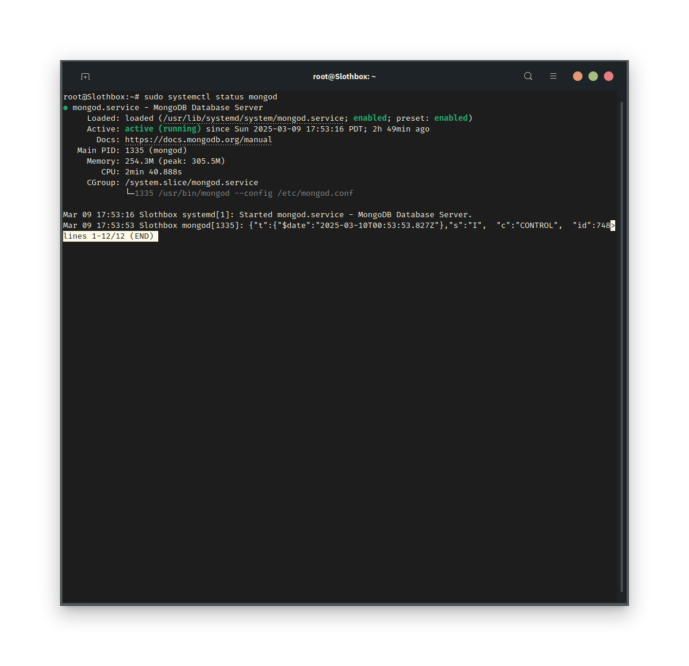
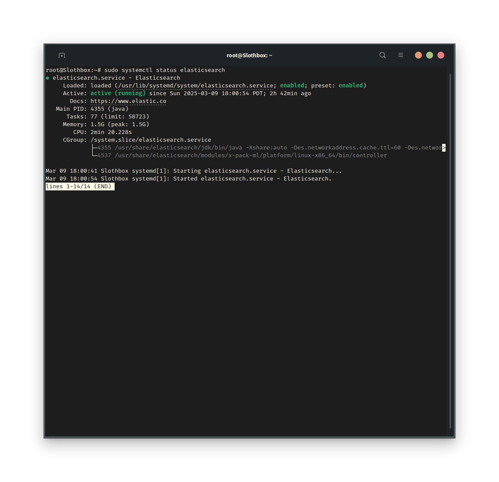
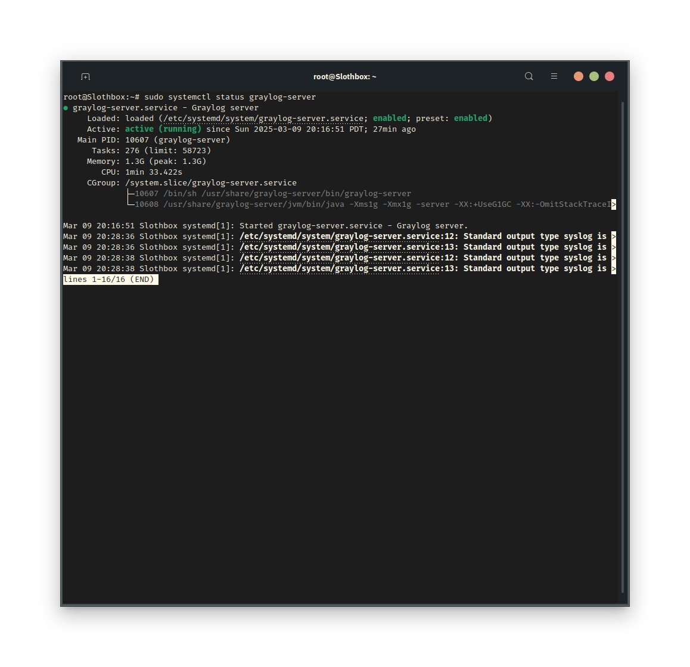
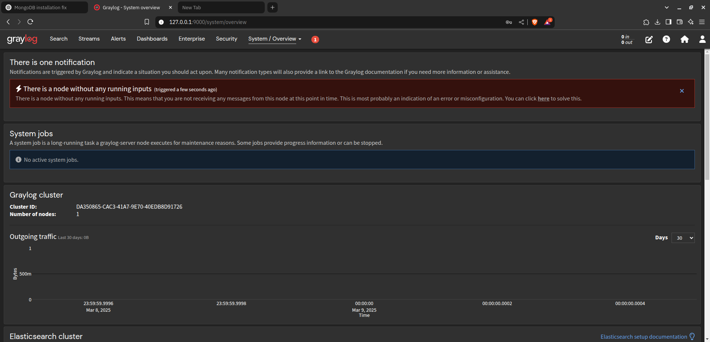
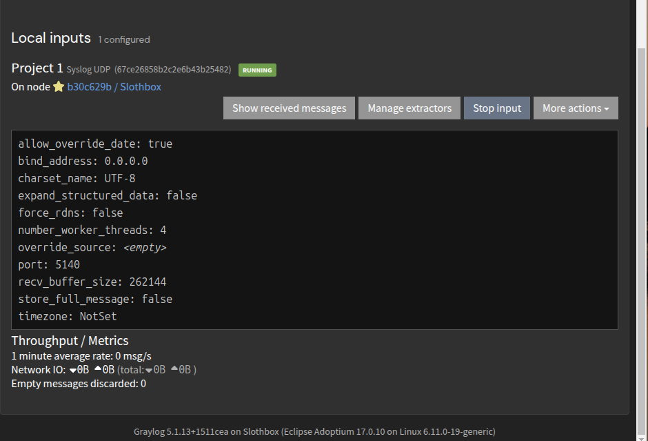
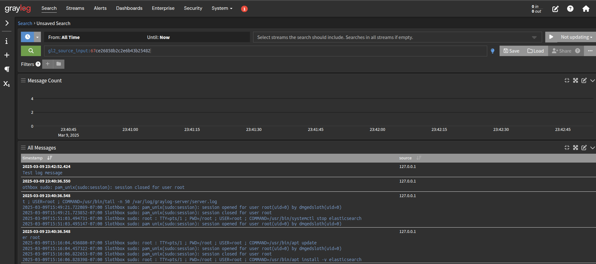
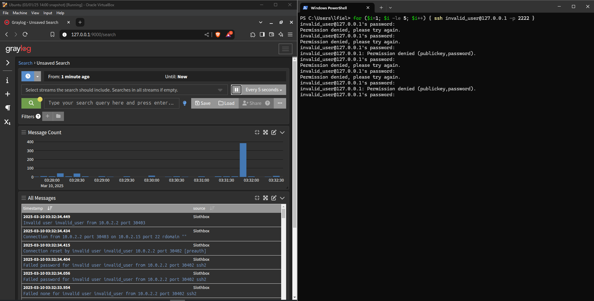
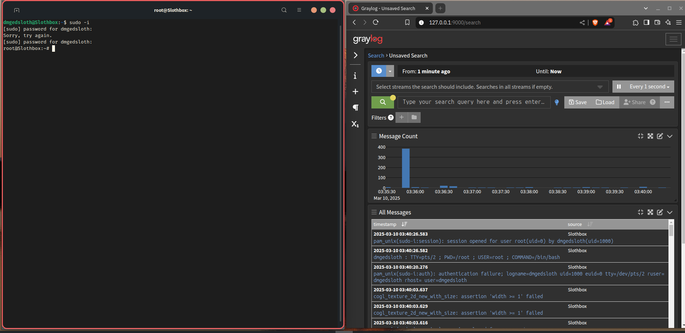

# SOC Log Analysis & Threat Hunting in Graylog

## Overview
This project showcases log analysis and threat hunting using **Graylog**, an open-source SIEM alternative to Splunk. The focus is on monitoring authentication logs, detecting security anomalies, and visualizing insights via dashboards.

## Why This Project Matters
- **Practical Experience:** SIEM tools are essential for **SOC Analysts & Security Engineers**.
- **Threat Detection:** Demonstrates how to analyze logs for failed login attempts and privilege escalation.
- **Portfolio-Worthy:** Structured for **GitHub presentation**, complete with screenshots, dashboards, and a threat report.


## Tools & Technologies Used
| Tool          | Purpose                           |
|--------------|----------------------------------|
| **Graylog**  | Log collection & analysis       |
| **MongoDB**  | Database for Graylog            |
| **Elasticsearch** | Indexing for Graylog       |
| **Ubuntu**   | Linux-based test environment    |
| **SSH & Syslog** | Log sources                |
| **Git & GitHub** | Version control & portfolio |


## 🚀 Step-by-Step Guide to Setup & Verify Graylog

### 1️⃣ Verify Installed Services & System Readiness

#### Step 1: Check MongoDB (mongod) Status
```
sudo systemctl status mongod
```
📸 Screenshot: 

#### Step 2: Check Elasticsearch Status
``` 
sudo systemctl status elasticsearch
```
📸 Screenshot: 

#### Step 3: Check Graylog Status
```bash
sudo systemctl status graylog-server
```
📸 Screenshot: 

#### Step 4: Log into Graylog Web Interface
- Open a browser and go to: **http://your-server-ip:9000**
- Log in with **admin credentials**.

📸 Screenshot: 

#### Step 5: Show System Overview in Graylog
- Navigate to **System > Overview**.

📸 Screenshot: 

### 2️⃣ Configure & Import Sample Logs

#### Step 1: Ensure Syslog Input is Enabled
1. In **Graylog**, go to **System > Inputs**.
2. Confirm that a **Syslog UDP** or **Syslog TCP** input is running.
3. If not, create one:
   - Click **Create Input**.
   - Select **Syslog UDP**.
   - Bind to `0.0.0.0`, Port `5140`.
   - Click **Launch Input**.

📸 Screenshot: 

#### Step 2: Verify Logs Are Being Received
1. In **System > Inputs**, locate your **Syslog UDP** input.
2. Click **Show Received Messages** to confirm logs are being processed.

📸 Screenshot: 

### 3️⃣ Simulating Security Threats

#### Simulating Failed Login Attempts
```
ssh invalid_user@localhost
```
📸 Screenshot: 

#### Simulating Privilege Escalation
```
sudo -i
```
📸 Screenshot: 

### Create a Security Dashboard
*Due to a VM crash, this step could not be completed, but the intended setup involved:*
- Creating a SOC Threat Overview dashboard in Graylog.
- Adding widgets for failed logins, privilege escalation, and suspicious activity.

### Generate a Threat Report
*The threat report export could not be generated, but the expected output would include a PDF summarizing detected threats.*


## 🚨 Graylog Troubleshooting Summary

During the setup process, several issues were encountered and resolved. Below is a summary of the key challenges and fixes:

### 1️⃣ Initial Issues Encountered
- **Elasticsearch 8.x was not supported by Graylog**, causing integration failure.
- **Graylog failed to start due to a missing password_secret** in its configuration.
- **MongoDB connectivity issues were checked**, but it was running fine.
- **Graylog required an SHA-256 hashed root password** for admin access.

---

### 2️⃣ Fixing Elasticsearch Issues

#### A. Removed Unsupported Elasticsearch 8.x
```
sudo systemctl stop elasticsearch
sudo apt remove --purge elasticsearch -y
sudo rm -rf /var/lib/elasticsearch /etc/elasticsearch
```

#### B. Installed Elasticsearch 7.10.2 (Compatible Version)
```
wget https://artifacts.elastic.co/downloads/elasticsearch/elasticsearch-7.10.2-amd64.deb
sudo dpkg -i elasticsearch-7.10.2-amd64.deb
sudo systemctl enable elasticsearch
sudo systemctl start elasticsearch
curl -X GET "http://127.0.0.1:9200"
```
📌 **Outcome:** Elasticsearch successfully installed and running.

---

### 3️⃣ Fixing Graylog Issues

#### A. Configured Missing password_secret
```
pwgen -N 1 -s 96
sudo nano /etc/graylog/server/server.conf
```
📌 **Edit the file and set the following:**
```
password_secret = YourGeneratedSecretHere
```

#### B. Generated Admin Password Hash (Required for Login)
```
echo -n 'StrongPassword123' | sha256sum
```
📌 **Copy the generated SHA-256 hash** and add it to `server.conf`:
```
root_password_sha2 = <Generated Hash>
```

#### C. Restarted Graylog Service
```
sudo systemctl restart graylog-server
sudo systemctl status graylog-server
```
📌 **Outcome:** Graylog restarted successfully with the correct configuration.


### 4️⃣ Verifying Graylog Web Access

- Open browser and access **http://127.0.0.1:9000**.
- Log in using:
  - **Username:** `admin`
  - **Password:** The plaintext password used for the SHA-256 hash.

📌 **Outcome:** Successfully logged into the Graylog web interface, fully integrated with **Elasticsearch 7.10.2** and **MongoDB**.


✅ **With these fixes, Graylog is fully functional and ready for log analysis & threat hunting.**

## 🔗 What’s Next?

### Planned Enhancements
- ✅ Integrate **additional log sources** (e.g., firewall, IDS).

---

## 📌 Final Thoughts
This project is designed to **demonstrate real-world SOC skills** in a structured, professional manner. By simulating security incidents and using Graylog for log analysis, this repository provides tangible proof of **SIEM & threat detection expertise**.
